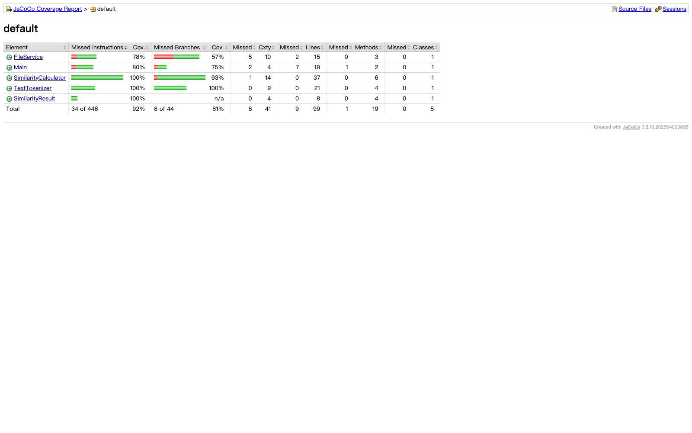

# 单元测试覆盖率

这张图来自 JaCoCo 0.8.13 生成的 HTML 覆盖率报告。先运行项目的 15 个单元测试，再由 JaCoCo 代理记录执行结果并生成报告，没有手工填写覆盖率数据。

本次测试结果为 `15 passed, 0 failed`，覆盖率汇总如下：

| 指标 | 结果 |
| --- | ---: |
| 指令覆盖率 | 92% |
| 分支覆盖率 | 81% |
| 行覆盖率 | 90/99，约 91% |
| 方法覆盖率 | 18/19，约 95% |
| 类覆盖率 | 5/5，100% |

报告中可以继续点击 `FileService`、`Main`、`SimilarityCalculator` 和 `TextTokenizer`，查看具体源码行的覆盖情况。博客中使用这张图说明整体覆盖率，并结合测试用例列表说明测试范围。
