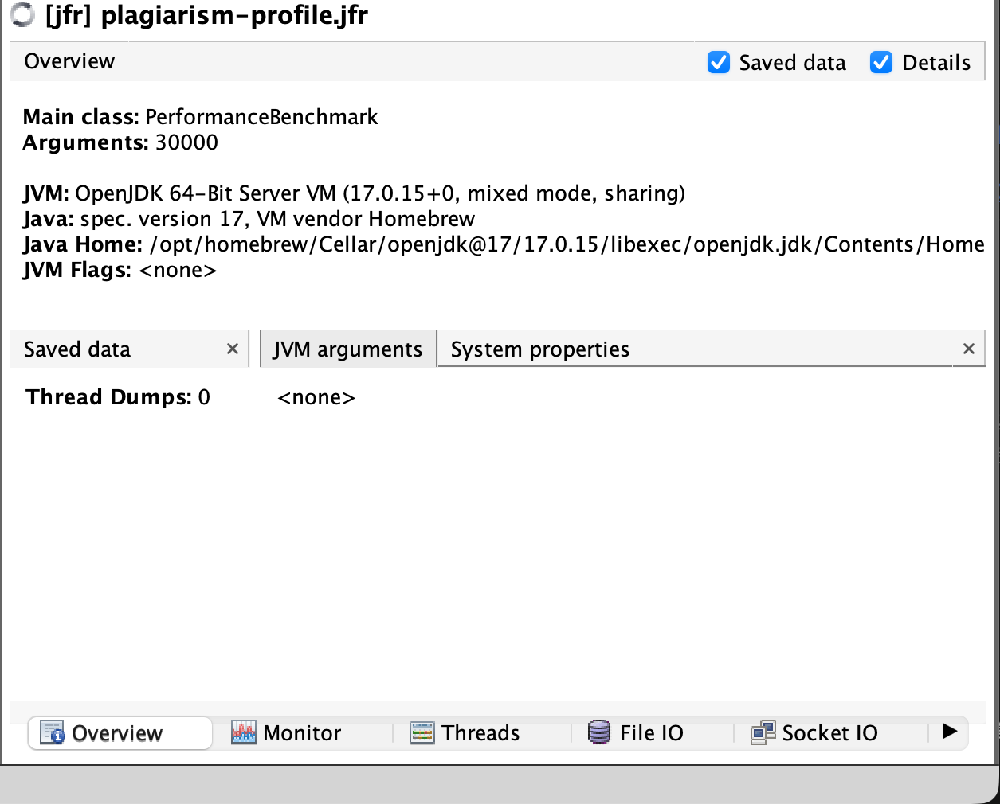

# 性能分析记录

`PerformanceBenchmark.java` 会在内存中重复计算一组较长的中英文文本，用于观察查重计算的热点函数。它不是评测入口，不会被 `main.jar` 打包。

运行示例：

```bash
cd 3124004108
bash scripts/build.sh
mkdir -p build/performance-classes
javac -encoding UTF-8 -d build/performance-classes \
  -cp build/classes performance/PerformanceBenchmark.java
java -cp build/classes:build/performance-classes PerformanceBenchmark 30
```

最后一个参数是迭代次数，省略时默认为 30。使用 VisualVM 进行采样时可以临时使用较大的次数，让进程保持足够长的时间：

```bash
java -cp build/classes:build/performance-classes PerformanceBenchmark 3000
```

## 本次记录

本次使用 JDK Flight Recorder 记录了 `PerformanceBenchmark 30000` 的运行过程，再用 VisualVM 打开 `build/plagiarism-profile.jfr` 查看。截图中的运行环境为 OpenJDK 17，主类是 `PerformanceBenchmark`。

从 JFR 的 `jdk.ExecutionSample` 样本看，采样主要落在以下调用路径：

- `TextTokenizer.tokenize`：遍历字符、识别中文字符和英文/数字 token；
- `SimilarityCalculator.frequency`：使用 `HashMap` 统计 token 出现次数；
- `SimilarityCalculator.calculate`：组织两段文本的 token 化和频率统计。



这张图是实际运行后从 VisualVM 窗口截取的记录，不是手工绘制的示意图。博客中可以直接引用这张图片，并结合上面的调用路径说明性能观察结果。
