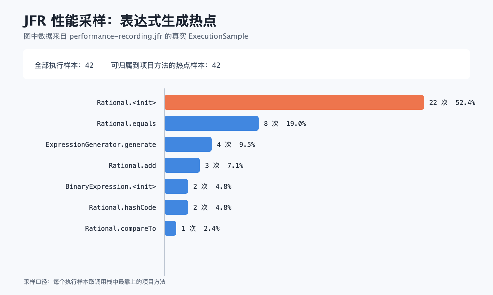

# 性能分析记录

## 如何复现

在项目目录执行：

```bash
bash scripts/profile.sh
```

脚本先以 JFR `profile` 配置运行 `PerformanceBenchmark`，参数固定为每轮 10,000 题、范围 10、连续 60 轮，再读取 `jdk.ExecutionSample` 生成热点图。原始 `.jfr` 文件在本地生成但不提交仓库，避免把较大的二进制记录长期放进版本库。

## 改进内容

第一次采样中，`Rational.toString` 占项目热点样本的 40.7%。原因是旧实现把整棵表达式递归拼成字符串，再把字符串放入 `HashSet` 去重。字符串只为判重服务，却产生了很多数字转换和临时对象。

改进后增加 `ExpressionKey`：数字节点直接保留约分后的 `Rational`，二元节点保留运算符和左右子键；`+`、`×` 的 `equals` 同时检查原顺序与交换顺序。这样仍然严格符合题目的去重定义，但不再为每道候选题拼接长字符串。

同一台机器、相同参数下的结果：

| 阶段 | 60 轮总耗时 | 每轮 10,000 题平均耗时 | 生成速度 |
| --- | ---: | ---: | ---: |
| 改进前 | 1.237 s | 20.611 ms | 485,185 题/s |
| 改进后 | 0.992 s | 16.528 ms | 605,036 题/s |

平均耗时减少约 19.8%。对应原始输出分别保存在 `benchmark-before.txt` 和 `benchmark-result.txt`。

## 性能图



改进后的最大项目热点是 `Rational.<init>`。它负责符号整理和最大公约数约分，是精确分数运算必须经过的步骤；当前生成 10,000 道题只需几十毫秒，继续加入缓存反而会增加实现复杂度，所以没有再做无依据的微优化。
